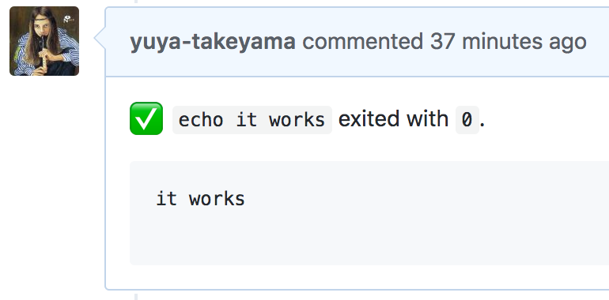

# Circle GH Tee

Command to execute a command and post its result to GitHub Pull Request



## Usage

```
$ circle-gh-tee [OPTIONS] -- <COMMAND>...
```

### Required environment variable

* `GITHUB_ACCESS_TOKEN`
  * Personal access token of GitHub
  * Required scope
    * `repo`: Full control of private repositories

Other variables are assumed to be set by Circle CI

* `CIRCLE_PROJECT_USERNAME`
* `CIRCLE_PROJECT_REPONAME`
* `CI_PULL_REQUEST`

### Options

* `--exit-zero-template <TEMPLATE>`
  * Comment template used when exit code is zero
* `--exit-non-zero-template <TEMPLATE>`
  * Comment template used when exit code is non-zero

### Template variables
  * `{{full_command}}`
    * Executed command
    * e.g. `make test`
  * `{{result}}`
    * Output of the executed command
    * Both of stdout and stderr are merged
  * `{{exit_status}}`
    * Exit status of the executed command
    * e.g `0`
